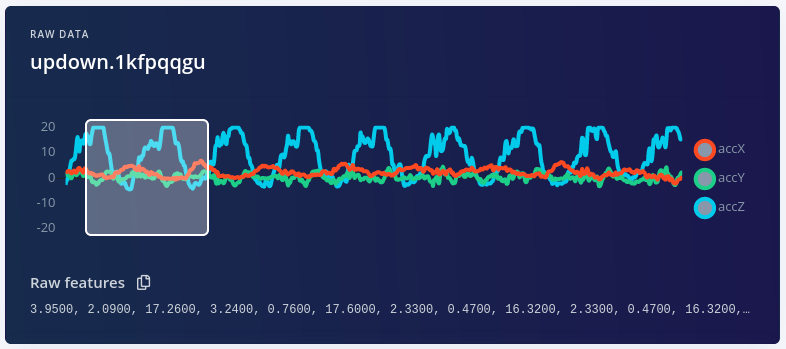

# Running your Impulse locally/On your zephyr board

Impulses can be deployed as a C++ library. This packages all your signal processing blocks, configuration and learning blocks up into a single package. You can include this package in your own application to run the impulse locally. In this tutorial you'll export an impulse, and build an application for the nRF52840DK board running Zephyr RTOS to classify sensor data.

> **Knowledge required**  
> This tutorial assumes that you're familiar with building applications for the [nRF52840DK][nrf52840dk_docs] or other **Zephyr RTOS** supported board, and have your environment set up to compile applications for this platform. Currently application is optimized for [NRF Connect SDK v1.3.0][ncs_130_docs] which uses [Zephyr RTOS v2.3.0-rc1][zephyr_230_docs]

## Prerequisites

Make sure you followed the Continuous motion recognition tutorial, and have a trained impulse. If the build system is not in place you should follow these guides:
* [install NRF Connect SDK][ncs_install] - this will install Zephyr and all dependencies
* [install Segger J-Link tools][jlink_tools] for firmware flashing. 

## Cloning the base repository
We created an example repository which contains a small application, which takes the raw features as an argument, and prints out the final classification. You can either [download the application][app_gh_download] or import this repository using Git:

```bash
git clone https://github.com/edgeimpulse/example-standalone-inferencing-nrf52-zephyr.git
```

## Deploying your impulse
Head over to your Edge Impulse project, and go to **Deployment**. From here you can create the full library which contains the impulse and all external required libraries. Select **C++ library** and click **Build** to create the library.

Download the `.zip` file and place the contents in the 'example-standalone-inferencing-nrf52-zephyr' folder (which you downloaded above). Your final folder structure should look like this:

```bash
 example-standalone-inferencing-nrf52-zephyr
 ├── CMakeLists.txt
 ├── docs
 ├── edge-impulse-sdk
 ├── model-parameters
 ├── porting
 ├── prj.conf
 ├── README.md
 ├── sample.yaml
 ├── src
 ├── tflite-model
 └── utils
```

## Running the impulse
With the project ready it's time to verify that the application works. Head back to the studio and click on **Live classification**. Then load a validation sample, and click on a row under 'Detailed result'.

<p align="center">
  <br><br>
  <i>Selecting the row with timestamp '320' under 'Detailed result'</i><br>
</p>

To verify that the local application classifies the same, we need the raw features for this timestamp. To do so click on the 'Copy to clipboard' button next to 'Raw features'. This will copy the raw values from this validation file, before any signal processing or inferencing happened.

<p align="center">
  <br><br>
  <i>Copying the raw features</i><br>
</p>

In the example directory open `src/main.cpp` and paste the raw features inside the `static const float features[]` definition, for example:
```c
static const float features[] = {
    3.9500, 2.0900, 17.2600, 3.2400, 0.7600, 17.6000 ...
};
```
Then build the application by opening a terminal or command prompt, navigating to the 'example-standalone-inferencing-nrf52-zephyr' folder and run:
```bash
$ west build -b nrf52840dk_nrf52840
```

This generates binary files in the build/ directory that can be flashed on the [nRF52840DK][nrf52840dk_docs] using onboard a J-LINK.

#### Flashing using a *west* and J-LINK
Connect your board, usually via USB, and turn it on if there’s a power switch.Then flash the sample using [west flash][west_flash]:
```bash
$ west flash
```

## Seeing the output
To see the output of the impulse, connect to the development board over a serial port (provided by the onboard J-LINK) on baud rate 115,200.  
This will run the signal processing pipeline, and then classify the output:
```
*** Booting Zephyr OS build v2.3.0-rc1-ncs1  ***
Edge Impulse standalone inferencing (Zephyr)
Features (14 ms.): 1.531785 0.992063 1.732565 1.984127 0.509300 2.976190 0.282135 0.079512 0.308956 0.015747 0.003525 0.997847 2.480159 0.892365 0.992063 0.582132 0.000000 0.000000 0.009061 0.034836 0.020850 0.019193 7.826533 0.992063 9.8 
Running neural network...
Predictions (time: 0 ms.):
idle:   0.000000
snake:  0.000000
updown: 0.996094
wave:   0.000000
Anomaly score (time: 1 ms.): -0.050449
run_classifier returned: 0
Predictions (DSP: 14 ms., Classification: 0 ms., Anomaly: 1 ms.): 
[0.000000, 0.000000, 0.996094, 0.000000, -0.050449]
```

Which matches the values we just saw in the studio. You now have your impulse running on your nRF52840DK Zephyr RTOS enabled development board!

## Troubleshooting

### Invalid choice: 'build'

Example:
```bash
$ west build -b nrf52840dk_nrf52840
usage: west [-h] [-z ZEPHYR_BASE] [-v] [-V] <command> ...
west: error: argument <command>: invalid choice: 'build' (choose from 'init', 'update', 'list', 'manifest', 'diff', 'status', 'forall', 'help', 'config', 'topdir', 'selfupdate')
```

This error happens when we are trying to build the example project outside of installed `ncs/zephyr` directory and we did not set environment variables.
To solve this problem we can either move the example project inside `ncs/zephyr/samples` directory and build it from there or we can set required environment variables as seen in Nordic's [documentation][zephyr_env_docs].

[nrf52840dk_docs]: https://developer.nordicsemi.com/nRF_Connect_SDK/doc/1.3.0/zephyr/boards/arm/nrf52840dk_nrf52840/doc/index.html
[ncs_130_docs]: https://developer.nordicsemi.com/nRF_Connect_SDK/doc/1.3.0/nrf/index.html
[zephyr_230_docs]: https://developer.nordicsemi.com/nRF_Connect_SDK/doc/1.3.0/zephyr/index.html
[ncs_install]: https://developer.nordicsemi.com/nRF_Connect_SDK/doc/1.3.0/nrf/gs_assistant.html
[jlink_tools]: https://www.segger.com/downloads/jlink/#J-LinkSoftwareAndDocumentationPack
[app_gh_download]: https://github.com/edgeimpulse/example-standalone-inferencing-nrf52-zephyr/archive/develop.zip
[west_flash]: https://developer.nordicsemi.com/nRF_Connect_SDK/doc/1.3.0/zephyr/guides/west/build-flash-debug.html#west-flashing
[zephyr_env_docs]: https://developer.nordicsemi.com/nRF_Connect_SDK/doc/latest/nrf/gs_installing.html#setting-up-the-command-line-build-environment
